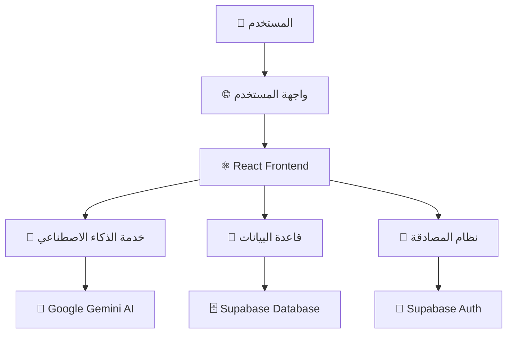

# 🌍 TravelAI - مساعدك الذكي للسفر

<div align="center">


**خطط لرحلات مثالية بمساعدة الذكاء الاصطناعي**

[](https://travelai.vip)
[](#)
[](#)

[العربية](#arabic) • [English](#english) • [Español](#español) • [Français](#français) • [Deutsch](#deutsch) • [中文](#chinese) • [日本語](#japanese)

</div>

---

## 🎯 نظرة عامة

**TravelAI** هو مساعد سفر ذكي يستخدم تقنيات الذكاء الاصطناعي المتقدمة لإنشاء جداول سفر مخصصة وشخصية. يدعم التطبيق 7 لغات ويوفر تجربة سلسة للمستخدمين المسجلين والضيوف.

### ✨ **الميزات الرئيسية:**

- 🤖 **ذكاء اصطناعي متقدم** - يستخدم Google Gemini لإنتاج جداول مخصصة
- 🌍 **دعم متعدد اللغات** - 7 لغات مع دعم RTL للعربية
- 📱 **تصميم متجاوب** - يعمل بسلاسة على جميع الأجهزة
- 👤 **وضع الضيف** - استخدام كامل بدون تسجيل
- 💾 **حفظ تلقائي** - مزامنة البيانات عبر الأجهزة
- 🎤 **إدخال صوتي** - تحويل الكلام إلى نص
- 📊 **جداول تفاعلية** - تعديل وتخصيص الأنشطة
- 📄 **تصدير PDF** - حفظ الجداول كملفات PDF
- 🔐 **أمان متقدم** - حماية البيانات والخصوصية

---

## 🚀 البدء السريع

### **المتطلبات الأساسية:**
- Node.js 18+ 
- npm أو yarn
- حساب Supabase (اختياري)
- مفتاح Google Gemini AI

### **1. استنساخ المشروع:**
```bash
git clone https://github.com/your-username/travelai.git
cd travelai
```

### **2. تثبيت التبعيات:**
```bash
npm install
```

### **3. إعداد متغيرات البيئة:**
```bash
cp .env.example .env
```

قم بتعديل ملف `.env` وأضف المفاتيح المطلوبة:
```env
# Supabase Configuration (اختياري - للمستخدمين المسجلين)
VITE_SUPABASE_URL=your_supabase_url_here
VITE_SUPABASE_ANON_KEY=your_supabase_anon_key_here

# Google Gemini AI Configuration (مطلوب)
VITE_GEMINI_API_KEY=your_gemini_api_key_here

# reCAPTCHA Configuration (اختياري)
VITE_RECAPTCHA_SITE_KEY=your_recaptcha_site_key_here
```

### **4. تشغيل التطبيق:**
```bash
npm run dev
```

🎉 **التطبيق جاهز على:** `http://localhost:8080`

---

## 🏗️ معمارية التطبيق



### **📁 هيكل المشروع:**
```
src/
├── 📁 components/           # مكونات الواجهة
│   ├── 🎨 ui/              # مكونات التصميم الأساسية
│   ├── 💬 ChatArea.tsx     # منطقة الدردشة
│   ├── 📋 ItineraryTable.tsx # جدول الرحلة
│   ├── 🎤 VoiceRecording.tsx # التسجيل الصوتي
│   └── 🔐 AuthModal.tsx    # نافذة تسجيل الدخول
│
├── 📁 services/            # الخدمات الخلفية
│   ├── 🤖 aiService.ts     # خدمة الذكاء الاصطناعي
│   ├── 💬 conversationService.ts # إدارة المحادثات
│   └── 📊 analyticsService.ts # التحليلات
│
├── 📁 hooks/               # React Hooks
│   ├── 🔐 useAuth.ts       # إدارة المصادقة
│   └── 🎤 useVoiceRecording.ts # التسجيل الصوتي
│
├── 📁 lib/                 # المكتبات المساعدة
│   └── 💾 supabase.ts      # إعداد قاعدة البيانات
│
└── 📁 i18n/                # الترجمة متعددة اللغات
    └── 📁 locales/         # ملفات الترجمة
```

---

## 🔧 التقنيات المستخدمة

### **Frontend:**
- ⚛️ **React 18** + TypeScript
- 🎨 **Tailwind CSS** + shadcn/ui
- 🌐 **React Router** للتنقل
- 🌍 **i18next** للترجمة
- 📱 **Responsive Design**

### **Backend & Services:**
- 🤖 **Google Gemini AI** للذكاء الاصطناعي
- 💾 **Supabase** لقاعدة البيانات والمصادقة
- 📊 **Analytics Service** للتحليلات
- 🎤 **Web Speech API** للتسجيل الصوتي

### **Development Tools:**
- ⚡ **Vite** للبناء والتطوير
- 📦 **npm** لإدارة الحزم
- 🔧 **ESLint** + TypeScript للجودة
- 🚀 **Bolt Hosting** للنشر

---

## 🌍 الدعم متعدد اللغات

التطبيق يدعم 7 لغات بالكامل:

| اللغة | الكود | الحالة | دعم RTL |
|-------|------|--------|---------|
| العربية | `ar` | ✅ مكتمل | ✅ نعم |
| English | `en` | ✅ مكتمل | ❌ لا |
| Español | `es` | ✅ مكتمل | ❌ لا |
| Français | `fr` | ✅ مكتمل | ❌ لا |
| Deutsch | `de` | ✅ مكتمل | ❌ لا |
| 中文 | `zh` | ✅ مكتمل | ❌ لا |
| 日本語 | `ja` | ✅ مكتمل | ❌ لا |

---

## 🗄️ قاعدة البيانات

### **الجداول الرئيسية:**

#### **👥 profiles** - ملفات المستخدمين
```sql
- id (uuid, primary key)
- email (text)
- full_name (text)
- avatar_url (text)
- created_at, updated_at (timestamps)
```

#### **💬 conversations** - المحادثات
```sql
- id (uuid, primary key)
- user_id (uuid, optional للضيوف)
- guest_session_id (uuid, للضيوف)
- title (text)
- is_guest (boolean)
- created_at, updated_at (timestamps)
```

#### **📝 messages** - الرسائل
```sql
- id (uuid, primary key)
- conversation_id (uuid)
- content (text)
- role ('user' | 'assistant')
- metadata (jsonb - للجداول)
- created_at (timestamp)
```

#### **🗺️ itineraries** - جداول السفر
```sql
- id (uuid, primary key)
- conversation_id (uuid)
- city, country (text)
- days (jsonb - الأنشطة اليومية)
- total_cost (decimal)
- created_at, updated_at (timestamps)
```

---

## 🎯 كيفية الاستخدام

### **للمستخدمين:**

1. **🌐 زيارة الموقع:** [TravelAI.vip](https://travelai.vip)
2. **🗣️ اختيار اللغة** المفضلة
3. **✍️ كتابة طلب السفر** أو استخدام الاقتراحات
4. **🤖 الحصول على جدول مخصص** من الذكاء الاصطناعي
5. **✏️ تعديل الجدول** حسب الحاجة
6. **📄 تصدير PDF** للجدول النهائي

### **للمطورين:**

#### **إضافة ميزة جديدة:**
```bash
# إنشاء مكون جديد
touch src/components/NewFeature.tsx

# إضافة خدمة جديدة
touch src/services/newService.ts

# إضافة ترجمة
# تعديل ملفات src/i18n/locales/*.json
```

#### **تشغيل الاختبارات:**
```bash
npm run test
```

#### **بناء للإنتاج:**
```bash
npm run build
```

---

## 🔐 الأمان والخصوصية

### **🛡️ الحماية المطبقة:**
- **Row Level Security (RLS)** في قاعدة البيانات
- **تشفير البيانات** أثناء النقل
- **مصادقة آمنة** مع Supabase
- **حماية من البوتات** مع reCAPTCHA
- **إدارة الجلسات** المتقدمة

### **📊 البيانات المجمعة:**
- **تفاعلات المستخدمين** (مجهولة الهوية)
- **إحصائيات الاستخدام** لتحسين الخدمة
- **معدلات النجاح** لتطوير الذكاء الاصطناعي
- **لا يتم حفظ** المعلومات الشخصية الحساسة

---

## 🚀 النشر والاستضافة

### **النشر التلقائي:**
التطبيق منشور على: **[TravelAI.vip](https://travelai.vip)**

### **نشر محلي:**
```bash
# بناء التطبيق
npm run build

# معاينة البناء
npm run preview
```

### **نشر على منصات أخرى:**
- **Netlify:** متصل تلقائياً
- **Vercel:** `vercel --prod`
- **GitHub Pages:** `npm run build && gh-pages -d dist`

---

## 🤝 المساهمة في التطوير

### **كيفية المساهمة:**

1. **🍴 Fork** المشروع
2. **🌿 إنشاء فرع** للميزة الجديدة
   ```bash
   git checkout -b feature/amazing-feature
   ```
3. **💾 حفظ التغييرات**
   ```bash
   git commit -m 'Add amazing feature'
   ```
4. **📤 رفع التغييرات**
   ```bash
   git push origin feature/amazing-feature
   ```
5. **🔄 إنشاء Pull Request**

### **📋 إرشادات المساهمة:**
- اتبع معايير الكود الموجودة
- أضف اختبارات للميزات الجديدة
- حدث الترجمات لجميع اللغات
- اكتب تعليقات واضحة

---

## 🐛 الإبلاغ عن المشاكل

### **🔍 قبل الإبلاغ:**
- تأكد من أن المشكلة لم يتم الإبلاغ عنها مسبقاً
- جرب إعادة تحميل الصفحة
- تحقق من اتصال الإنترنت

### **📝 معلومات مطلوبة:**
- **نوع المتصفح** والإصدار
- **نوع الجهاز** (حاسوب/جوال)
- **خطوات إعادة المشكلة**
- **رسائل الخطأ** إن وجدت
- **لقطات شاشة** مفيدة

---

## 📚 التوثيق التقني

### **🔗 روابط مفيدة:**
- [📖 دليل المطور](./docs/developer-guide.md)
- [🏗️ مخطط المعمارية](./docs/app-architecture.md)
- [🌐 دليل الترجمة](./docs/translation-guide.md)
- [🔧 دليل النشر](./docs/deployment-guide.md)

### **🛠️ APIs المستخدمة:**
- [Google Gemini AI](https://ai.google.dev/)
- [Supabase](https://supabase.com/)
- [Web Speech API](https://developer.mozilla.org/en-US/docs/Web/API/Web_Speech_API)

---

## 📊 إحصائيات المشروع

<div align="center">

| المقياس | القيمة |
|---------|--------|
| 📁 **إجمالي الملفات** | 50+ |
| 📝 **أسطر الكود** | 3000+ |
| 🌍 **اللغات المدعومة** | 7 |
| 🎨 **المكونات** | 25+ |
| ⚡ **سرعة التحميل** | < 2 ثانية |
| 📱 **دعم الأجهزة** | 100% |

</div>

---

## 🎨 لقطات الشاشة

### **🖥️ الشاشة الرئيسية:**


### **💬 واجهة الدردشة:**


### **📋 جدول الرحلة:**


---

## 🔄 دورة التطوير

### **📅 الإصدارات:**
- **v1.0.0-beta** - الإصدار التجريبي الأول
- **v1.1.0** - إضافة الخرائط التفاعلية (قريباً)
- **v1.2.0** - تطبيق الجوال (مخطط)

### **🎯 الميزات القادمة:**
- 🗺️ **خرائط تفاعلية** مع Google Maps
- 🏨 **تكامل الحجوزات** مع منصات السفر
- 📱 **تطبيق الجوال** مع React Native
- 🤖 **ذكاء اصطناعي محسن** مع نماذج أكثر تقدماً
- 🎯 **اقتراحات شخصية** بناءً على التاريخ
- 🌐 **تكامل مع خدمات خارجية**

---

## 🏆 الشكر والتقدير

### **💝 شكر خاص لـ:**
- **Google Gemini AI** - للذكاء الاصطناعي المتقدم
- **Supabase** - لقاعدة البيانات والمصادقة
- **Tailwind CSS** - للتصميم الجميل
- **shadcn/ui** - للمكونات الأنيقة
- **React Team** - للمكتبة الرائعة

### **🌟 المساهمون:**
- [اسم المطور الرئيسي] - التطوير والتصميم
- [المساهمون الآخرون] - الترجمة والاختبار

---

## 📞 التواصل والدعم

### **💬 طرق التواصل:**
- **📧 البريد الإلكتروني:** support@travelai.vip
- **🐛 الإبلاغ عن المشاكل:** [GitHub Issues](https://github.com/your-username/travelai/issues)
- **💡 اقتراح ميزات:** [GitHub Discussions](https://github.com/your-username/travelai/discussions)

### **🆘 الدعم الفني:**
- **📖 الوثائق:** متوفرة في مجلد `/docs`
- **❓ الأسئلة الشائعة:** [FAQ](./docs/faq.md)
- **🎥 فيديوهات تعليمية:** قريباً

---

## 📄 الترخيص

هذا المشروع مرخص تحت **رخصة MIT** - راجع ملف [LICENSE](LICENSE) للتفاصيل.

```
MIT License

Copyright (c) 2025 TravelAI

Permission is hereby granted, free of charge, to any person obtaining a copy
of this software and associated documentation files (the "Software"), to deal
in the Software without restriction, including without limitation the rights
to use, copy, modify, merge, publish, distribute, sublicense, and/or sell
copies of the Software, and to permit persons to whom the Software is
furnished to do so, subject to the following conditions:

The above copyright notice and this permission notice shall be included in all
copies or substantial portions of the Software.
```

---

## 🎯 الخلاصة

**TravelAI** يمثل مستقبل تخطيط السفر بالذكاء الاصطناعي. مع دعم متعدد اللغات، وتصميم حديث، وميزات متقدمة، يوفر التطبيق تجربة فريدة لتخطيط الرحلات.

<div align="center">

**🌟 جرب التطبيق الآن: [TravelAI.vip](https://travelai.vip) 🌟**

**صُنع بـ ❤️ للمسافرين حول العالم**

---

[](https://github.com/your-username/travelai)
[](https://github.com/your-username/travelai)
[](https://github.com/your-username/travelai/issues)

</div>

---

<div align="center">

### 🚀 **ابدأ رحلتك القادمة مع TravelAI!** 🚀

</div>