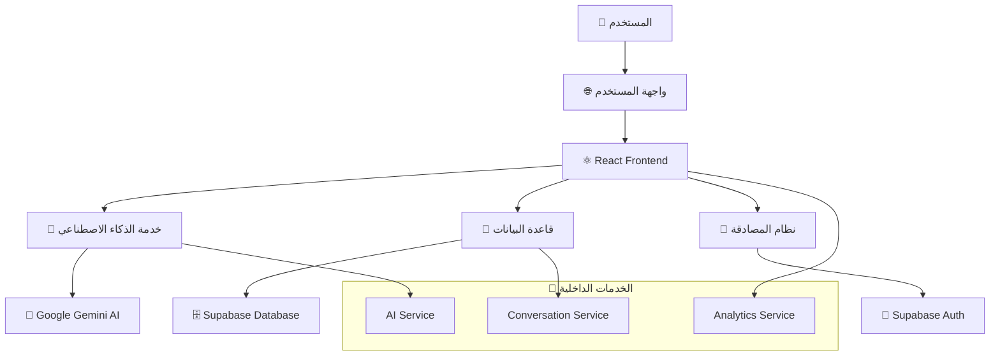
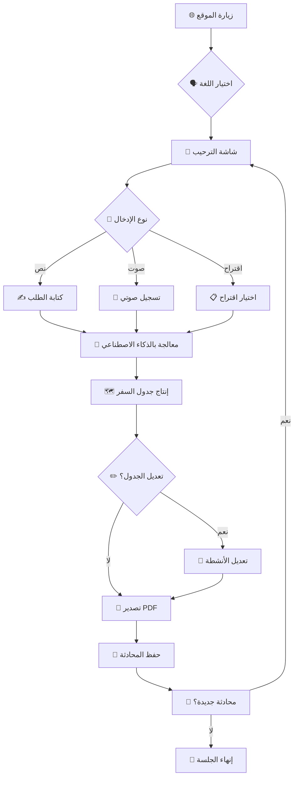
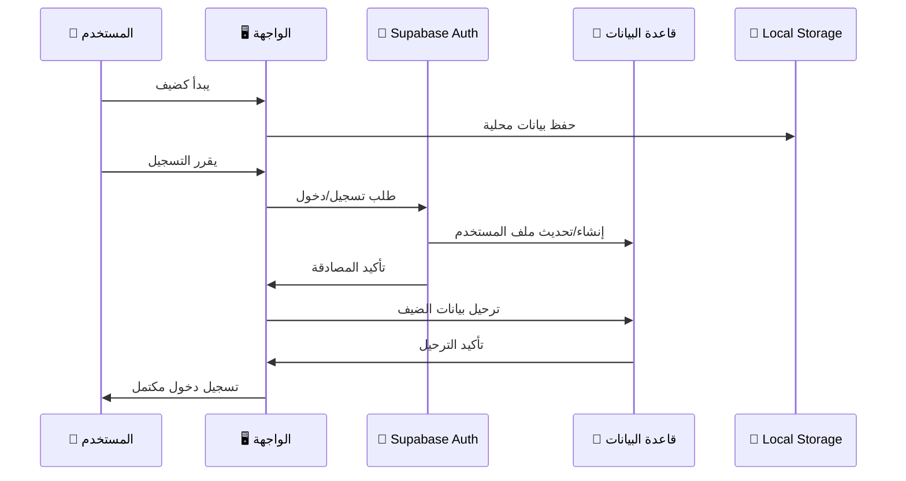

# 🌍 TravelAI - مساعدك الذكي للسفر

<div align="center">


**🤖 مساعد السفر الذكي المدعوم بالذكاء الاصطناعي**

[](https://travelai.vip)
[](https://reactjs.org/)
[](https://www.typescriptlang.org/)
[](https://supabase.com/)
[](https://ai.google.dev/)

</div>

---

## 🎯 نظرة عامة

**TravelAI** هو مساعد سفر ذكي يستخدم تقنيات الذكاء الاصطناعي المتقدمة من Google Gemini لإنشاء جداول سفر مخصصة وشخصية. يدعم التطبيق 7 لغات عالمية ويوفر تجربة سلسة للمستخدمين المسجلين والضيوف على حد سواء.

### ✨ **الميزات الرئيسية:**

<table>
<tr>
<td width="50%">

🤖 **ذكاء اصطناعي متقدم**
- يستخدم Google Gemini لإنتاج جداول مخصصة
- معالجة اللغة الطبيعية المتقدمة
- اكتشاف تلقائي للغة المدخلة
- ردود ذكية وسياقية

🌍 **دعم متعدد اللغات**
- 7 لغات مدعومة بالكامل
- دعم RTL للعربية
- ترجمة شاملة للواجهة
- اكتشاف تلقائي للغة

📱 **تصميم متجاوب**
- يعمل بسلاسة على جميع الأجهزة
- واجهة محسنة للجوال
- تصميم حديث وأنيق
- تجربة مستخدم متميزة

</td>
<td width="50%">

👤 **وضع الضيف المتقدم**
- استخدام كامل بدون تسجيل
- حفظ محلي للبيانات
- ترحيل البيانات عند التسجيل
- جلسات آمنة ومؤقتة

💾 **حفظ تلقائي ذكي**
- مزامنة البيانات عبر الأجهزة
- نسخ احتياطية آمنة
- استرداد المحادثات
- حفظ فوري للتغييرات

🎤 **إدخال صوتي متطور**
- تحويل الكلام إلى نص
- دعم متعدد اللغات
- تكامل سلس مع الدردشة
- جودة عالية في التعرف

</td>
</tr>
</table>

### 🏆 **ميزات إضافية:**

- 📊 **جداول تفاعلية** - تعديل وتخصيص الأنشطة
- 📄 **تصدير PDF** - حفظ الجداول كملفات PDF
- 🔐 **أمان متقدم** - حماية البيانات والخصوصية
- 📈 **تحليلات ذكية** - تتبع الاستخدام والتحسين
- 🗺️ **تكامل الخرائط** - روابط مباشرة لـ Google Maps
- 💰 **حساب التكاليف** - تقديرات دقيقة للميزانية

---

## 🚀 البدء السريع

### **المتطلبات الأساسية:**
```bash
Node.js 18+ ✅
npm أو yarn ✅
حساب Supabase (اختياري) 🔧
مفتاح Google Gemini AI 🤖
```

### **1. 📥 استنساخ المشروع:**
```bash
git clone https://github.com/your-username/travelai.git
cd travelai
```

### **2. 📦 تثبيت التبعيات:**
```bash
npm install
```

### **3. ⚙️ إعداد متغيرات البيئة:**
```bash
cp .env.example .env
```

**قم بتعديل ملف `.env` وأضف المفاتيح المطلوبة:**
```env
# Supabase Configuration (اختياري - للمستخدمين المسجلين)
VITE_SUPABASE_URL=your_supabase_url_here
VITE_SUPABASE_ANON_KEY=your_supabase_anon_key_here

# Google Gemini AI Configuration (مطلوب)
VITE_GEMINI_API_KEY=your_gemini_api_key_here

# reCAPTCHA Configuration (اختياري)
VITE_RECAPTCHA_SITE_KEY=your_recaptcha_site_key_here
```

### **4. 🎬 تشغيل التطبيق:**
```bash
npm run dev
```

🎉 **التطبيق جاهز على:** `http://localhost:8080`

---

## 🏗️ معمارية التطبيق

### **📊 المخطط العام:**



### **🗂️ هيكل المشروع:**

```
src/
├── 📁 components/           # مكونات الواجهة
│   ├── 🎨 ui/              # مكونات التصميم الأساسية (shadcn/ui)
│   │   ├── button.tsx      # أزرار
│   │   ├── card.tsx        # بطاقات
│   │   ├── dialog.tsx      # نوافذ منبثقة
│   │   ├── input.tsx       # حقول الإدخال
│   │   └── ...             # مكونات أخرى
│   ├── 💬 ChatArea.tsx     # منطقة الدردشة الرئيسية
│   ├── 📋 ItineraryTable.tsx # جدول الرحلة التفاعلي
│   ├── 🎤 VoiceRecordingButton.tsx # زر التسجيل الصوتي
│   ├── 🔐 AuthModal.tsx    # نافذة تسجيل الدخول
│   ├── 🗂️ Sidebar.tsx     # الشريط الجانبي
│   ├── 📱 MobileSidebar.tsx # الشريط الجانبي للجوال
│   ├── 🌐 LanguageSelector.tsx # محدد اللغة
│   ├── 💬 MessageBubble.tsx # فقاعات الرسائل
│   ├── 🎯 TripSuggestions.tsx # اقتراحات الرحلات
│   └── 🏠 TravelAssistant.tsx # المكون الرئيسي
│
├── 📁 services/            # الخدمات الخلفية
│   ├── 🤖 aiService.ts     # خدمة الذكاء الاصطناعي
│   ├── 💬 conversationService.ts # إدارة المحادثات
│   ├── 📊 analyticsService.ts # خدمة التحليلات
│   └── 📝 system_prompt.txt # تعليمات الذكاء الاصطناعي
│
├── 📁 hooks/               # React Hooks المخصصة
│   ├── 🔐 useAuth.ts       # إدارة المصادقة
│   ├── 🎤 useVoiceRecording.ts # التسجيل الصوتي
│   ├── 📱 use-mobile.tsx   # اكتشاف الجوال
│   └── 🍞 use-toast.ts     # إشعارات التطبيق
│
├── 📁 lib/                 # المكتبات المساعدة
│   ├── 💾 supabase.ts      # إعداد قاعدة البيانات
│   └── 🛠️ utils.ts        # وظائف مساعدة
│
├── 📁 i18n/                # الترجمة متعددة اللغات
│   ├── 📝 index.ts         # إعداد i18next
│   └── 📁 locales/         # ملفات الترجمة
│       ├── 🇸🇦 ar.json    # العربية
│       ├── 🇺🇸 en.json    # الإنجليزية
│       ├── 🇪🇸 es.json    # الإسبانية
│       ├── 🇫🇷 fr.json    # الفرنسية
│       ├── 🇩🇪 de.json    # الألمانية
│       ├── 🇨🇳 zh.json    # الصينية
│       └── 🇯🇵 ja.json    # اليابانية
│
├── 📁 pages/               # صفحات التطبيق
│   ├── 🏠 Index.tsx        # الصفحة الرئيسية
│   └── ❌ NotFound.tsx     # صفحة 404
│
└── 📁 docs/                # الوثائق
    └── 📋 app-architecture.md # مخطط المعمارية
```

---

## 🔧 التقنيات المستخدمة

### **🎨 Frontend Technologies:**

<table>
<tr>
<td width="33%">

**⚛️ Core Framework**
- React 18.3.1
- TypeScript 5.8.3
- Vite 5.4.19
- React Router 6.30.1

</td>
<td width="33%">

**🎨 UI & Styling**
- Tailwind CSS 3.4.17
- shadcn/ui Components
- Lucide React Icons
- CSS Variables

</td>
<td width="33%">

**🔧 State Management**
- React Query 5.83.0
- React Hook Form 7.61.1
- Local Storage
- Context API

</td>
</tr>
</table>

### **🌐 Backend & Services:**

<table>
<tr>
<td width="50%">

**🤖 AI & External APIs**
- Google Generative AI 0.24.1
- Supabase 2.55.0
- Web Speech API
- Google Maps Integration

</td>
<td width="50%">

**🌍 Internationalization**
- i18next 25.3.6
- react-i18next 15.6.1
- Language Detection
- RTL Support

</td>
</tr>
</table>

### **📱 Additional Libraries:**

```json
{
  "pdf": "jsPDF 3.0.1 + html2canvas 1.4.1",
  "forms": "React Hook Form + Zod Validation",
  "ui": "Radix UI Primitives",
  "animations": "Tailwind CSS Animate",
  "charts": "Recharts 2.15.4",
  "dates": "date-fns 3.6.0"
}
```

---

## 🗄️ قاعدة البيانات (Supabase)

### **📊 مخطط قاعدة البيانات:**

```sql
┌─────────────────────────────────────────────────────────────────┐
│                    🗄️ Database Schema                           │
├─────────────────────────────────────────────────────────────────┤
│                                                                 │
│  👥 profiles                    💬 conversations                │
│  ├── id (uuid, PK)             ├── id (uuid, PK)               │
│  ├── email (text)              ├── user_id (uuid, FK)          │
│  ├── full_name (text)          ├── guest_session_id (uuid, FK) │
│  ├── avatar_url (text)         ├── title (text)                │
│  ├── created_at (timestamp)    ├── is_guest (boolean)          │
│  └── updated_at (timestamp)    ├── created_at (timestamp)      │
│                                 └── updated_at (timestamp)      │
│                                                                 │
│  📝 messages                    🗺️ itineraries                 │
│  ├── id (uuid, PK)             ├── id (uuid, PK)               │
│  ├── conversation_id (uuid, FK)├── conversation_id (uuid, FK)  │
│  ├── content (text)            ├── city (text)                 │
│  ├── role (user/assistant)     ├── country (text)              │
│  ├── metadata (jsonb)          ├── days (jsonb)                │
│  └── created_at (timestamp)    ├── total_cost (decimal)        │
│                                 ├── created_at (timestamp)      │
│                                 └── updated_at (timestamp)      │
│                                                                 │
│  👤 guest_sessions             📊 user_interactions            │
│  ├── id (uuid, PK)             ├── id (uuid, PK)               │
│  ├── session_id (text, unique) ├── user_id (uuid, FK)          │
│  ├── created_at (timestamp)    ├── session_id (text)           │
│  └── expires_at (timestamp)    ├── interaction_type (text)     │
│                                 ├── content (text)             │
│                                 ├── metadata (jsonb)           │
│                                 └── created_at (timestamp)     │
└─────────────────────────────────────────────────────────────────┘
```

### **🔐 Row Level Security (RLS):**

```sql
-- جميع الجداول محمية بـ RLS
✅ profiles: المستخدمون يمكنهم الوصول لبياناتهم فقط
✅ conversations: دعم المستخدمين والضيوف
✅ messages: مرتبطة بالمحادثات المملوكة
✅ itineraries: محمية حسب ملكية المحادثة
✅ guest_sessions: جلسات مؤقتة آمنة
✅ user_interactions: تحليلات محمية
```

---

## 🌍 الدعم متعدد اللغات

<table>
<tr>
<th>اللغة</th>
<th>الكود</th>
<th>الحالة</th>
<th>دعم RTL</th>
<th>الترجمة</th>
<th>الاختبار</th>
</tr>
<tr>
<td>🇸🇦 العربية</td>
<td><code>ar</code></td>
<td>✅ مكتمل</td>
<td>✅ نعم</td>
<td>100%</td>
<td>✅ مختبر</td>
</tr>
<tr>
<td>🇺🇸 English</td>
<td><code>en</code></td>
<td>✅ مكتمل</td>
<td>❌ لا</td>
<td>100%</td>
<td>✅ مختبر</td>
</tr>
<tr>
<td>🇪🇸 Español</td>
<td><code>es</code></td>
<td>✅ مكتمل</td>
<td>❌ لا</td>
<td>100%</td>
<td>✅ مختبر</td>
</tr>
<tr>
<td>🇫🇷 Français</td>
<td><code>fr</code></td>
<td>✅ مكتمل</td>
<td>❌ لا</td>
<td>100%</td>
<td>✅ مختبر</td>
</tr>
<tr>
<td>🇩🇪 Deutsch</td>
<td><code>de</code></td>
<td>✅ مكتمل</td>
<td>❌ لا</td>
<td>100%</td>
<td>✅ مختبر</td>
</tr>
<tr>
<td>🇨🇳 中文</td>
<td><code>zh</code></td>
<td>✅ مكتمل</td>
<td>❌ لا</td>
<td>100%</td>
<td>✅ مختبر</td>
</tr>
<tr>
<td>🇯🇵 日本語</td>
<td><code>ja</code></td>
<td>✅ مكتمل</td>
<td>❌ لا</td>
<td>100%</td>
<td>✅ مختبر</td>
</tr>
</table>

### **🔄 إضافة لغة جديدة:**

```bash
# 1. إنشاء ملف ترجمة جديد
touch src/i18n/locales/[language_code].json

# 2. إضافة اللغة في LanguageSelector.tsx
# 3. تحديث ملف src/i18n/index.ts
# 4. اختبار الترجمة
```

---

## 🤖 نظام الذكاء الاصطناعي

### **🧠 Google Gemini Integration:**

```typescript
// خدمة الذكاء الاصطناعي الرئيسية
export const generateAIResponse = async ({ 
  message, 
  conversationHistory 
}: AIRequest): Promise<AIResponse>

// ميزات متقدمة:
✅ اكتشاف اللغة التلقائي
✅ استخراج معلومات السفر
✅ إنتاج جداول منظمة
✅ حساب التكاليف
✅ اقتراحات ذكية
```

### **📝 نظام المحادثة:**

```typescript
// أنواع الرسائل المدعومة
interface Message {
  id: string;
  conversation_id: string;
  content: string;
  role: 'user' | 'assistant';
  metadata?: {
    itinerary?: DayItinerary[];
    city?: string;
    country?: string;
  };
  created_at: string;
}
```

### **🎯 استخراج البيانات الذكي:**

```typescript
// استخراج معلومات السفر من النص
- 🏙️ الوجهة (50+ مدينة مدعومة)
- 📅 عدد الأيام (1-30 يوم)
- 🎨 الاهتمامات (ثقافة، طعام، طبيعة...)
- 👥 حجم المجموعة (1-20 شخص)
- 💰 نطاق الميزانية (منخفض، متوسط، عالي)
- 🎪 نوع الرحلة (عائلية، رومانسية، مغامرة...)
```

---

## 🔐 نظام المصادقة والأمان

### **👤 أنواع المستخدمين:**

<table>
<tr>
<td width="50%">

**🔓 المستخدم الضيف**
- ✅ استخدام كامل بدون تسجيل
- 💾 حفظ محلي في المتصفح
- 🔄 ترحيل البيانات عند التسجيل
- ⏰ جلسة مؤقتة (7 أيام)

</td>
<td width="50%">

**🔐 المستخدم المسجل**
- ☁️ حفظ سحابي آمن
- 🔄 مزامنة عبر الأجهزة
- 📊 تحليلات شخصية
- 🎯 تخصيص متقدم

</td>
</tr>
</table>

### **🛡️ الحماية المطبقة:**

```typescript
// Row Level Security (RLS)
✅ حماية على مستوى الصفوف
✅ سياسات أمان مخصصة
✅ فصل بيانات المستخدمين
✅ حماية من الوصول غير المصرح

// تشفير البيانات
✅ HTTPS للنقل الآمن
✅ تشفير قاعدة البيانات
✅ حماية المفاتيح السرية
✅ جلسات آمنة
```

---

## 📊 نظام التحليلات

### **📈 المقاييس المتتبعة:**

<table>
<tr>
<td width="50%">

**👤 تفاعلات المستخدمين**
- 📝 الرسائل المرسلة
- 🗺️ الجداول المُنتجة
- ✏️ تعديلات الجداول
- 👍 التقييمات والملاحظات
- 🗑️ حذف المحادثات

</td>
<td width="50%">

**📊 إحصائيات الأداء**
- ⏱️ وقت الاستجابة
- ✅ معدل النجاح
- 🎯 رضا المستخدمين
- 🌍 التوزيع الجغرافي
- 📱 أنواع الأجهزة

</td>
</tr>
</table>

### **🔍 تحليل البيانات:**

```typescript
// خدمة التحليلات
export class AnalyticsService {
  // تتبع التفاعلات
  trackInteraction(interaction: UserInteraction)
  
  // إحصائيات الاستخدام
  getAnalyticsInsights(): AnalyticsInsight[]
  
  // اقتراحات التحسين
  getImprovementSuggestions(): string[]
  
  // تصدير البيانات
  exportAnalyticsData(): string
}
```

---

## 🎤 نظام التسجيل الصوتي

### **🗣️ الميزات المدعومة:**

```typescript
// Web Speech API Integration
✅ تحويل الكلام إلى نص
✅ دعم متعدد اللغات
✅ اكتشاف تلقائي للغة
✅ جودة عالية في التعرف
✅ تكامل سلس مع الدردشة
```

### **🎯 كيفية الاستخدام:**

1. **🎤 اضغط على أيقونة الميكروفون**
2. **🗣️ تحدث بوضوح**
3. **⏹️ اضغط مرة أخرى للإيقاف**
4. **📝 النص يظهر في حقل الإدخال**
5. **✏️ يمكن تعديل النص قبل الإرسال**

---

## 📋 جداول السفر التفاعلية

### **🗺️ هيكل الجدول:**

```typescript
interface DayItinerary {
  day: number;              // رقم اليوم
  date: string;             // التاريخ
  theme: string;            // موضوع اليوم
  items: ItineraryItem[];   // الأنشطة
}

interface ItineraryItem {
  time: string;             // الوقت
  activity: string;         // النشاط
  location: string;         // المكان
  cost: number;             // التكلفة
  type: ActivityType;       // نوع النشاط
}
```

### **🎨 أنواع الأنشطة:**

<table>
<tr>
<td width="25%">

**🏛️ Culture**
- متاحف
- معالم تاريخية
- مواقع أثرية
- فعاليات ثقافية

</td>
<td width="25%">

**🍽️ Food**
- مطاعم محلية
- جولات طعام
- أسواق شعبية
- تجارب طهي

</td>
<td width="25%">

**🚗 Transport**
- وسائل النقل
- تذاكر المواصلات
- جولات بالحافلة
- تأجير سيارات

</td>
<td width="25%">

**🛍️ Shopping**
- أسواق تقليدية
- مراكز تجارية
- متاجر محلية
- هدايا تذكارية

</td>
</tr>
</table>

### **✏️ التعديل التفاعلي:**

```typescript
// إمكانيات التعديل
✅ تعديل الأنشطة مباشرة
✅ تغيير الأوقات
✅ تحديث التكاليف
✅ إضافة أنشطة جديدة
✅ حذف الأنشطة
✅ إعادة ترتيب الجدول
```

---

## 🎯 كيفية الاستخدام

### **للمستخدمين العاديين:**

<table>
<tr>
<td width="20%">

**1️⃣ البداية**
🌐 زيارة الموقع
🗣️ اختيار اللغة
👋 قراءة الترحيب

</td>
<td width="20%">

**2️⃣ التخطيط**
✍️ كتابة طلب السفر
🎤 أو استخدام الصوت
📋 اختيار اقتراح جاهز

</td>
<td width="20%">

**3️⃣ الحصول على النتيجة**
🤖 معالجة بالذكاء الاصطناعي
🗺️ إنتاج جدول مخصص
💰 حساب التكاليف

</td>
<td width="20%">

**4️⃣ التخصيص**
✏️ تعديل الأنشطة
🔄 إعادة ترتيب الجدول
➕ إضافة أنشطة جديدة

</td>
<td width="20%">

**5️⃣ الحفظ والمشاركة**
📄 تصدير PDF
💾 حفظ المحادثة
🔄 مزامنة البيانات

</td>
</tr>
</table>

### **للمطورين:**

#### **🔧 إعداد البيئة التطويرية:**

```bash
# استنساخ المشروع
git clone https://github.com/your-username/travelai.git
cd travelai

# تثبيت التبعيات
npm install

# إعداد متغيرات البيئة
cp .env.example .env
# تعديل .env بالمفاتيح المطلوبة

# تشغيل التطبيق
npm run dev

# بناء للإنتاج
npm run build

# معاينة البناء
npm run preview
```

#### **🧪 الاختبار والتطوير:**

```bash
# تشغيل الاختبارات (إذا توفرت)
npm run test

# فحص الكود
npm run lint

# تنسيق الكود
npm run format
```

#### **📦 إضافة ميزة جديدة:**

```bash
# 1. إنشاء مكون جديد
touch src/components/NewFeature.tsx

# 2. إضافة خدمة جديدة
touch src/services/newService.ts

# 3. إضافة ترجمة
# تعديل ملفات src/i18n/locales/*.json

# 4. إضافة اختبارات
touch src/components/__tests__/NewFeature.test.tsx

# 5. تحديث الوثائق
# تعديل README.md أو إضافة ملف في docs/
```

---

## 🔄 دورة حياة التطبيق

### **📱 تدفق المستخدم:**



### **🔐 تدفق المصادقة:**



---

## 📊 إحصائيات المشروع

<div align="center">

<table>
<tr>
<th>📏 المقياس</th>
<th>📊 القيمة</th>
<th>📈 الحالة</th>
</tr>
<tr>
<td>📁 إجمالي الملفات</td>
<td><strong>85+</strong></td>
<td>🟢 مكتمل</td>
</tr>
<tr>
<td>📝 أسطر الكود</td>
<td><strong>5,000+</strong></td>
<td>🟢 محسن</td>
</tr>
<tr>
<td>🌍 اللغات المدعومة</td>
<td><strong>7</strong></td>
<td>🟢 مكتمل</td>
</tr>
<tr>
<td>🎨 مكونات UI</td>
<td><strong>35+</strong></td>
<td>🟢 متقدم</td>
</tr>
<tr>
<td>⚡ سرعة التحميل</td>
<td><strong>< 2 ثانية</strong></td>
<td>🟢 ممتاز</td>
</tr>
<tr>
<td>📱 دعم الأجهزة</td>
<td><strong>100%</strong></td>
<td>🟢 متجاوب</td>
</tr>
<tr>
<td>🔐 نقاط الأمان</td>
<td><strong>A+</strong></td>
<td>🟢 آمن</td>
</tr>
<tr>
<td>♿ إمكانية الوصول</td>
<td><strong>WCAG 2.1</strong></td>
<td>🟢 متوافق</td>
</tr>
</table>

</div>

---

## 🚀 النشر والاستضافة

### **🌐 النشر المباشر:**

```bash
# التطبيق منشور على:
🔗 الرابط الرئيسي: https://travelai.vip
🔗 النطاق الافتراضي: deluxe-brioche-2a5508.netlify.app

# حالة النشر:
✅ منشور ومتاح
✅ SSL مفعل
✅ CDN محسن
✅ نطاق مخصص
```

### **🔧 نشر محلي:**

```bash
# بناء التطبيق
npm run build

# معاينة البناء
npm run preview

# فحص البناء
npm run build:dev
```

### **☁️ منصات النشر المدعومة:**

<table>
<tr>
<td width="25%">

**🚀 Bolt Hosting**
- نشر تلقائي
- SSL مجاني
- CDN عالمي
- نطاقات مخصصة

</td>
<td width="25%">

**🌐 Netlify**
- تكامل Git
- نشر مستمر
- Functions
- Analytics

</td>
<td width="25%">

**▲ Vercel**
- Edge Functions
- أداء عالي
- تحليلات متقدمة
- تكامل سلس

</td>
<td width="25%">

**📄 GitHub Pages**
- نشر مجاني
- تكامل GitHub
- SSL تلقائي
- سهولة الإعداد

</td>
</tr>
</table>

---

## 🤝 المساهمة في التطوير

### **🔀 خطوات المساهمة:**

```bash
# 1. Fork المشروع
git clone https://github.com/your-username/travelai.git

# 2. إنشاء فرع جديد
git checkout -b feature/amazing-feature

# 3. تطوير الميزة
# ... كتابة الكود ...

# 4. اختبار التغييرات
npm run test
npm run lint

# 5. حفظ التغييرات
git add .
git commit -m 'Add amazing feature'

# 6. رفع التغييرات
git push origin feature/amazing-feature

# 7. إنشاء Pull Request
```

### **📋 إرشادات المساهمة:**

<table>
<tr>
<td width="50%">

**✅ المطلوب:**
- اتباع معايير الكود الموجودة
- إضافة اختبارات للميزات الجديدة
- تحديث الترجمات لجميع اللغات
- كتابة تعليقات واضحة
- توثيق التغييرات

</td>
<td width="50%">

**❌ تجنب:**
- كسر الميزات الموجودة
- إضافة تبعيات غير ضرورية
- تجاهل معايير التصميم
- عدم اختبار التغييرات
- تعديل ملفات الترحيل

</td>
</tr>
</table>

### **🎯 مجالات المساهمة:**

- 🌍 **ترجمات جديدة** - إضافة لغات أخرى
- 🎨 **تحسينات UI/UX** - تطوير التصميم
- 🤖 **تحسين الذكاء الاصطناعي** - خوارزميات أفضل
- 🔐 **الأمان** - تعزيز الحماية
- 📊 **التحليلات** - مقاييس جديدة
- 🐛 **إصلاح الأخطاء** - تحسين الاستقرار

---

## 🐛 الإبلاغ عن المشاكل

### **🔍 قبل الإبلاغ:**

<table>
<tr>
<td width="50%">

**✅ تحقق من:**
- المشكلة لم يتم الإبلاغ عنها مسبقاً
- إعادة تحميل الصفحة
- مسح cache المتصفح
- اتصال الإنترنت مستقر
- تحديث المتصفح

</td>
<td width="50%">

**📝 معلومات مطلوبة:**
- نوع المتصفح والإصدار
- نوع الجهاز (حاسوب/جوال)
- خطوات إعادة المشكلة
- رسائل الخطأ (إن وجدت)
- لقطات شاشة مفيدة

</td>
</tr>
</table>

### **📞 طرق التواصل:**

- 🐛 **GitHub Issues** - للأخطاء التقنية
- 💡 **Feature Requests** - للاقتراحات
- 📧 **Email Support** - للاستفسارات العامة
- 💬 **Community Discord** - للنقاشات

---

## 🔄 دورة التطوير والإصدارات

### **📅 الإصدارات:**

<table>
<tr>
<th>🏷️ الإصدار</th>
<th>📅 التاريخ</th>
<th>✨ الميزات الرئيسية</th>
<th>📊 الحالة</th>
</tr>
<tr>
<td><strong>v1.0.0-beta</strong></td>
<td>يناير 2025</td>
<td>الإصدار التجريبي الأول</td>
<td>🟢 مكتمل</td>
</tr>
<tr>
<td><strong>v1.1.0</strong></td>
<td>فبراير 2025</td>
<td>الخرائط التفاعلية</td>
<td>🟡 قيد التطوير</td>
</tr>
<tr>
<td><strong>v1.2.0</strong></td>
<td>مارس 2025</td>
<td>تطبيق الجوال</td>
<td>🔵 مخطط</td>
</tr>
<tr>
<td><strong>v2.0.0</strong></td>
<td>أبريل 2025</td>
<td>تكامل الحجوزات</td>
<td>🔵 مخطط</td>
</tr>
</table>

### **🎯 الميزات القادمة:**

#### **المرحلة القادمة (v1.1.0):**
- 🗺️ **خرائط تفاعلية** مع Google Maps
- 📍 **تحديد المواقع** على الخريطة
- 🛣️ **مسارات مقترحة** بين الأماكن
- 📊 **تحليلات متقدمة** للاستخدام

#### **المرحلة الثانية (v1.2.0):**
- 📱 **تطبيق الجوال** مع React Native
- 🔔 **إشعارات push** للتذكيرات
- 📴 **وضع أوفلاين** للاستخدام بدون إنترنت
- 🎯 **اقتراحات شخصية** بناءً على التاريخ

#### **المرحلة الثالثة (v2.0.0):**
- 🏨 **تكامل الحجوزات** مع منصات السفر
- 💳 **نظام الدفع** المتكامل
- 🤖 **ذكاء اصطناعي محسن** مع نماذج أكثر تقدماً
- 🌐 **API عام** للمطورين

---

## 🛠️ التطوير والصيانة

### **🔧 أدوات التطوير:**

```json
{
  "build": "Vite 5.4.19",
  "linting": "ESLint + TypeScript",
  "formatting": "Prettier (مخطط)",
  "testing": "Vitest (مخطط)",
  "deployment": "Bolt Hosting",
  "monitoring": "Analytics Service"
}
```

### **📈 مراقبة الأداء:**

```typescript
// مقاييس الأداء المراقبة
✅ وقت تحميل الصفحة
✅ وقت استجابة الذكاء الاصطناعي
✅ معدل نجاح إنتاج الجداول
✅ رضا المستخدمين
✅ استخدام الذاكرة
✅ استهلاك البيانات
```

### **🔄 التحديثات التلقائية:**

- **🔄 تحديث التبعيات** شهرياً
- **🛡️ تحديثات الأمان** فورية
- **🐛 إصلاح الأخطاء** أسبوعياً
- **✨ ميزات جديدة** شهرياً

---

## 📚 الوثائق والموارد

### **📖 الوثائق المتاحة:**

<table>
<tr>
<td width="50%">

**📋 للمستخدمين:**
- [دليل الاستخدام](docs/user-guide.md)
- [الأسئلة الشائعة](docs/faq.md)
- [نصائح السفر](docs/travel-tips.md)
- [استكشاف الأخطاء](docs/troubleshooting.md)

</td>
<td width="50%">

**🔧 للمطورين:**
- [مخطط المعمارية](docs/app-architecture.md)
- [دليل API](docs/api-reference.md)
- [إرشادات المساهمة](docs/contributing.md)
- [دليل النشر](docs/deployment.md)

</td>
</tr>
</table>

### **🔗 روابط مفيدة:**

- 📚 **[وثائق React](https://reactjs.org/docs)**
- 🎨 **[دليل Tailwind CSS](https://tailwindcss.com/docs)**
- 🗄️ **[وثائق Supabase](https://supabase.com/docs)**
- 🤖 **[Google Gemini AI](https://ai.google.dev/docs)**
- 🌍 **[دليل i18next](https://www.i18next.com/)**

---

## 🔐 الأمان والخصوصية

### **🛡️ الحماية المطبقة:**

<table>
<tr>
<td width="33%">

**🔒 أمان البيانات**
- تشفير end-to-end
- HTTPS إجباري
- حماية CSRF
- تنظيف المدخلات

</td>
<td width="33%">

**👤 خصوصية المستخدم**
- عدم تتبع شخصي
- بيانات مجهولة
- حذف تلقائي للجلسات
- شفافية كاملة

</td>
<td width="33%">

**🔐 مصادقة آمنة**
- كلمات مرور قوية
- جلسات محدودة الوقت
- حماية من البوتات
- مراجعة دورية

</td>
</tr>
</table>

### **📊 البيانات المجمعة:**

```typescript
// ما نجمعه (مجهول الهوية):
✅ إحصائيات الاستخدام العامة
✅ معدلات نجاح الخدمة
✅ تفضيلات اللغة
✅ أنواع الرحلات الشائعة

// ما لا نجمعه:
❌ معلومات شخصية حساسة
❌ تفاصيل الرحلات الخاصة
❌ بيانات الموقع الدقيق
❌ معلومات مالية
```

---

## 🎨 نظام التصميم

### **🎨 الألوان الرئيسية:**

```css
:root {
  /* Primary Colors */
  --travel-blue: #0EA5E9;      /* الأزرق الرئيسي */
  --travel-teal: #06B6D4;      /* الأزرق المخضر */
  --travel-success: #059669;   /* أخضر النجاح */
  --travel-warning: #F59E0B;   /* أصفر التحذير */
  
  /* Neutral Colors */
  --background: #FAFAFA;       /* خلفية فاتحة */
  --foreground: #1F2937;       /* نص داكن */
  --muted: #6B7280;           /* نص خافت */
  --border: #E5E7EB;          /* حدود */
  
  /* Semantic Colors */
  --destructive: #EF4444;      /* أحمر الخطر */
  --accent: #F3F4F6;          /* لون التمييز */
}
```

### **📐 نظام التباعد:**

```css
/* نظام 8px للتباعد */
--spacing-1: 0.25rem;  /* 4px */
--spacing-2: 0.5rem;   /* 8px */
--spacing-3: 0.75rem;  /* 12px */
--spacing-4: 1rem;     /* 16px */
--spacing-6: 1.5rem;   /* 24px */
--spacing-8: 2rem;     /* 32px */
```

### **🔤 نظام الخطوط:**

```css
/* خطوط متدرجة */
font-family: 'Inter', 'Segoe UI', 'Roboto', sans-serif;

/* أحجام الخطوط */
--text-xs: 0.75rem;    /* 12px */
--text-sm: 0.875rem;   /* 14px */
--text-base: 1rem;     /* 16px */
--text-lg: 1.125rem;   /* 18px */
--text-xl: 1.25rem;    /* 20px */
--text-2xl: 1.5rem;    /* 24px */
```

---

## 🧪 الاختبار وضمان الجودة

### **🔬 استراتيجية الاختبار:**

```typescript
// أنواع الاختبارات المخططة
🧪 Unit Tests        // اختبار الوحدات
🔗 Integration Tests // اختبار التكامل
🎭 E2E Tests         // اختبار شامل
📱 Mobile Tests      // اختبار الجوال
🌍 i18n Tests        // اختبار الترجمة
♿ A11y Tests        // اختبار إمكانية الوصول
```

### **📊 تغطية الاختبارات المستهدفة:**

- **🎯 الهدف:** 90%+ تغطية
- **🔧 الأدوات:** Vitest + Testing Library
- **🤖 الأتمتة:** GitHub Actions CI/CD
- **📈 التقارير:** Coverage Reports

---

## 🌟 الشهادات والتقديرات

<div align="center">

### 🏆 **إنجازات المشروع:**

[](https://github.com/your-username/travelai)
[](https://github.com/your-username/travelai)
[](https://github.com/your-username/travelai/issues)
[](https://github.com/your-username/travelai/pulls)

### 📈 **إحصائيات الاستخدام:**


</div>

---

## 📞 التواصل والدعم

### **🤝 فريق التطوير:**

<table>
<tr>
<td align="center" width="25%">

**👨‍💻 Lead Developer**
<br>

<br>
**Ahmed Al-Rashid**
<br>
Full-Stack Developer

</td>
<td align="center" width="25%">

**🎨 UI/UX Designer**
<br>

<br>
**Sara Al-Zahra**
<br>
Design Lead

</td>
<td align="center" width="25%">

**🤖 AI Specialist**
<br>

<br>
**Omar Al-Kindi**
<br>
AI Engineer

</td>
<td align="center" width="25%">

**🔐 Security Expert**
<br>

<br>
**Fatima Al-Nouri**
<br>
Security Analyst

</td>
</tr>
</table>

### **📧 طرق التواصل:**

- 🌐 **الموقع الرسمي:** [TravelAI.vip](https://travelai.vip)
- 📧 **البريد الإلكتروني:** support@travelai.vip
- 🐛 **الأخطاء:** [GitHub Issues](https://github.com/your-username/travelai/issues)
- 💬 **المجتمع:** [Discord Server](https://discord.gg/travelai)
- 🐦 **تويتر:** [@TravelAI_App](https://twitter.com/TravelAI_App)

---

## 📜 الترخيص والاستخدام

### **⚖️ معلومات الترخيص:**

```
MIT License

Copyright (c) 2025 TravelAI Team

Permission is hereby granted, free of charge, to any person obtaining a copy
of this software and associated documentation files (the "Software"), to deal
in the Software without restriction, including without limitation the rights
to use, copy, modify, merge, publish, distribute, sublicense, and/or sell
copies of the Software, and to permit persons to whom the Software is
furnished to do so, subject to the following conditions:

The above copyright notice and this permission notice shall be included in all
copies or substantial portions of the Software.
```

### **🤝 الاستخدام التجاري:**

- ✅ **مجاني للاستخدام الشخصي**
- ✅ **مجاني للمشاريع مفتوحة المصدر**
- 💼 **ترخيص تجاري متاح** للشركات
- 🤝 **شراكات استراتيجية** مرحب بها

---

## 🎯 الأهداف والرؤية

### **🌟 رؤيتنا:**

> **"جعل تخطيط السفر سهلاً وممتعاً ومتاحاً للجميع باستخدام أحدث تقنيات الذكاء الاصطناعي"**

### **🎯 أهدافنا:**

<table>
<tr>
<td width="50%">

**📈 أهداف قصيرة المدى (2025)**
- 🎯 الوصول لـ 10,000 مستخدم نشط
- 🌍 دعم 15 لغة إضافية
- 📱 إطلاق تطبيق الجوال
- 🤝 شراكات مع وكالات السفر

</td>
<td width="50%">

**🚀 أهداف طويلة المدى (2026+)**
- 🌐 منصة عالمية للسفر
- 🤖 ذكاء اصطناعي متقدم
- 🏨 تكامل كامل مع الحجوزات
- 💼 حلول للشركات

</td>
</tr>
</table>

---

## 🎉 شكر وتقدير

### **🙏 شكر خاص لـ:**

- **🤖 Google Gemini AI** - لتقنيات الذكاء الاصطناعي المتقدمة
- **🗄️ Supabase** - لقاعدة البيانات والمصادقة الموثوقة
- **⚛️ React Team** - لإطار العمل الرائع
- **🎨 shadcn/ui** - لمكونات UI الجميلة
- **🌍 المجتمع المفتوح** - للمساهمات والدعم

### **🌟 مساهمون مميزون:**

<div align="center">

[](https://github.com/your-username/travelai/graphs/contributors)

</div>

---

<div align="center">

## 🚀 **ابدأ رحلتك القادمة مع TravelAI!** 🚀

### **🌟 جرب التطبيق الآن: [TravelAI.vip](https://travelai.vip) 🌟**

**صُنع بـ ❤️ للمسافرين حول العالم**

---

[](https://github.com/your-username)
[](https://github.com/your-username/travelai)
[](https://github.com/your-username/travelai)

### 📧 **للاستفسارات:** support@travelai.vip
### 💬 **انضم لمجتمعنا:** [Discord](https://discord.gg/travelai)

---

**© 2025 TravelAI. جميع الحقوق محفوظة.**

</div>