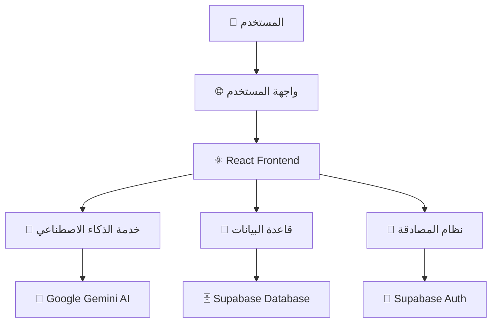
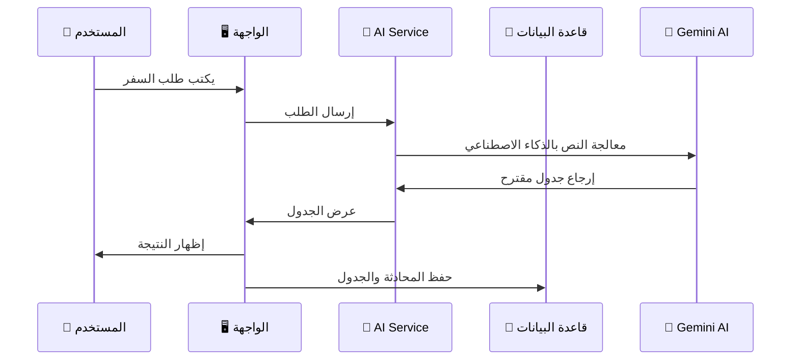
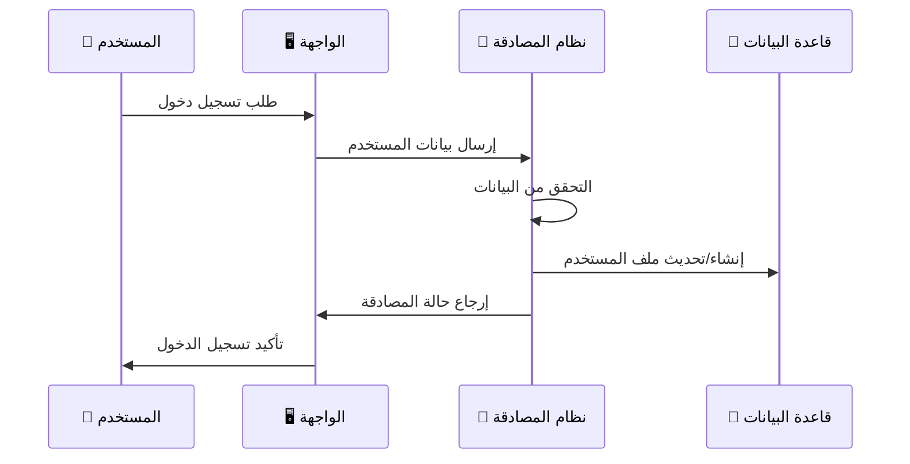
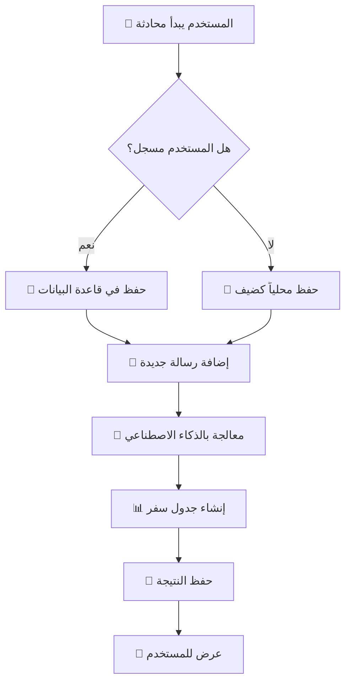
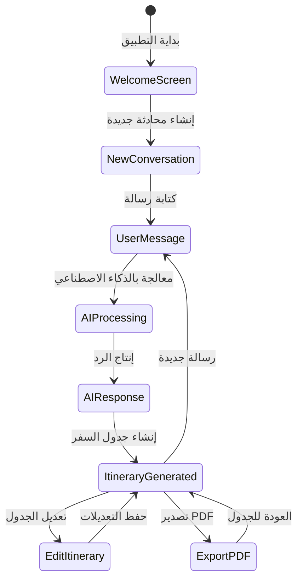
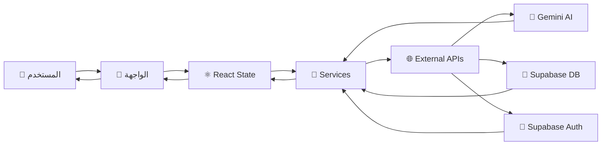
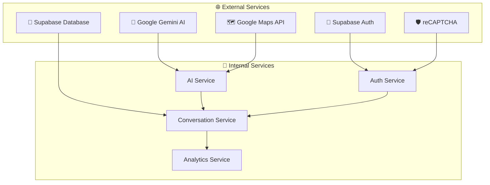

# 🏗️ مخطط معمارية تطبيق TravelAI

## 📋 نظرة عامة على التطبيق

```
┌─────────────────────────────────────────────────────────────────┐
│                        🌐 TravelAI Platform                     │
│                     مساعد السفر الذكي                          │
└─────────────────────────────────────────────────────────────────┘
```

---

## 🎯 الهيكل العام للتطبيق



---

## 🏛️ معمارية النظام الكاملة

```
┌─────────────────────────────────────────────────────────────────┐
│                          🖥️ Frontend Layer                      │
├─────────────────────────────────────────────────────────────────┤
│  ┌─────────────┐  ┌─────────────┐  ┌─────────────┐  ┌─────────┐ │
│  │   React     │  │  TypeScript │  │ Tailwind CSS│  │  i18n   │ │
│  │   Router    │  │   Hooks     │  │   Styling   │  │ Multi   │ │
│  │             │  │             │  │             │  │ Lang    │ │
│  └─────────────┘  └─────────────┘  └─────────────┘  └─────────┘ │
└─────────────────────────────────────────────────────────────────┘

┌─────────────────────────────────────────────────────────────────┐
│                        🔧 Services Layer                        │
├─────────────────────────────────────────────────────────────────┤
│  ┌─────────────┐  ┌─────────────┐  ┌─────────────┐  ┌─────────┐ │
│  │    AI       │  │ Conversation│  │  Analytics  │  │  Local  │ │
│  │  Service    │  │   Service   │  │   Service   │  │ Storage │ │
│  │             │  │             │  │             │  │         │ │
│  └─────────────┘  └─────────────┘  └─────────────┘  └─────────┘ │
└─────────────────────────────────────────────────────────────────┘

┌─────────────────────────────────────────────────────────────────┐
│                       🌐 External APIs                          │
├─────────────────────────────────────────────────────────────────┤
│  ┌─────────────┐  ┌─────────────┐  ┌─────────────┐  ┌─────────┐ │
│  │   Google    │  │   Supabase  │  │   Supabase  │  │  Voice  │ │
│  │   Gemini    │  │  Database   │  │    Auth     │  │   API   │ │
│  │     AI      │  │             │  │             │  │         │ │
│  └─────────────┘  └─────────────┘  └─────────────┘  └─────────┘ │
└─────────────────────────────────────────────────────────────────┘
```

---

## 🔄 تدفق العمليات الرئيسية

### 1️⃣ **تدفق إنشاء جدول السفر**



### 2️⃣ **تدفق المصادقة والتسجيل**



### 3️⃣ **تدفق إدارة المحادثات**



---

## 🗂️ هيكل المجلدات والملفات

```
src/
├── 📁 components/           # مكونات الواجهة
│   ├── 🎨 ui/              # مكونات التصميم الأساسية
│   ├── 💬 ChatArea.tsx     # منطقة الدردشة
│   ├── 📋 ItineraryTable.tsx # جدول الرحلة
│   ├── 🎤 VoiceRecording.tsx # التسجيل الصوتي
│   └── 🔐 AuthModal.tsx    # نافذة تسجيل الدخول
│
├── 📁 services/            # الخدمات الخلفية
│   ├── 🤖 aiService.ts     # خدمة الذكاء الاصطناعي
│   ├── 💬 conversationService.ts # إدارة المحادثات
│   └── 📊 analyticsService.ts # التحليلات
│
├── 📁 hooks/               # React Hooks
│   ├── 🔐 useAuth.ts       # إدارة المصادقة
│   └── 🎤 useVoiceRecording.ts # التسجيل الصوتي
│
├── 📁 lib/                 # المكتبات المساعدة
│   └── 💾 supabase.ts      # إعداد قاعدة البيانات
│
└── 📁 i18n/                # الترجمة متعددة اللغات
    └── 📁 locales/         # ملفات الترجمة
```

---

## 🔧 المكونات الرئيسية

### 🎯 **1. TravelAssistant (المكون الرئيسي)**
```typescript
┌─────────────────────────────────────┐
│         TravelAssistant             │
├─────────────────────────────────────┤
│ • إدارة حالة التطبيق العامة          │
│ • التحكم في المحادثات               │
│ • ربط جميع المكونات                │
│ • إدارة المصادقة                   │
└─────────────────────────────────────┘
```

### 💬 **2. ChatArea (منطقة الدردشة)**
```typescript
┌─────────────────────────────────────┐
│            ChatArea                 │
├─────────────────────────────────────┤
│ • عرض الرسائل                      │
│ • إدخال النصوص                     │
│ • التسجيل الصوتي                   │
│ • عرض جداول السفر                  │
└─────────────────────────────────────┘
```

### 📋 **3. ItineraryTable (جدول الرحلة)**
```typescript
┌─────────────────────────────────────┐
│          ItineraryTable             │
├─────────────────────────────────────┤
│ • عرض الأنشطة اليومية              │
│ • تعديل الأنشطة                    │
│ • حساب التكاليف                    │
│ • تصدير PDF                        │
└─────────────────────────────────────┘
```

### 🔐 **4. AuthModal (نافذة المصادقة)**
```typescript
┌─────────────────────────────────────┐
│            AuthModal                │
├─────────────────────────────────────┤
│ • تسجيل الدخول                     │
│ • إنشاء حساب جديد                  │
│ • تسجيل الدخول الاجتماعي           │
│ • إدارة الجلسات                    │
└─────────────────────────────────────┘
```

---

## 🗄️ قاعدة البيانات (Supabase)

```sql
┌─────────────────────────────────────────────────────────────┐
│                    📊 Database Schema                       │
├─────────────────────────────────────────────────────────────┤
│                                                             │
│  👥 profiles                    💬 conversations            │
│  ├── id (uuid)                 ├── id (uuid)               │
│  ├── email                     ├── user_id                 │
│  ├── full_name                 ├── title                   │
│  ├── avatar_url                ├── created_at              │
│  └── created_at                └── updated_at              │
│                                                             │
│  📝 messages                    🗺️ itineraries             │
│  ├── id (uuid)                 ├── id (uuid)               │
│  ├── conversation_id           ├── conversation_id         │
│  ├── content                   ├── city                    │
│  ├── role (user/assistant)     ├── country                 │
│  ├── metadata (json)           ├── days (json)             │
│  └── created_at                ├── total_cost              │
│                                 └── created_at              │
│                                                             │
│  👤 guest_sessions             📊 user_interactions        │
│  ├── id (uuid)                 ├── id (uuid)               │
│  ├── session_id                ├── user_id                 │
│  ├── created_at                ├── interaction_type        │
│  └── expires_at                ├── content                 │
│                                 ├── metadata (json)        │
│                                 └── created_at              │
└─────────────────────────────────────────────────────────────┘
```

---

## 🔄 دورة حياة المحادثة



---

## 🌐 تدفق البيانات



---

## 🎯 الميزات الرئيسية

### 🤖 **الذكاء الاصطناعي**
- **معالجة اللغة الطبيعية** باللغة العربية والإنجليزية
- **إنتاج جداول سفر مخصصة** حسب المتطلبات
- **اقتراحات ذكية** للأنشطة والأماكن
- **تحسين مستمر** بناءً على التفاعل

### 💾 **إدارة البيانات**
- **حفظ تلقائي** للمحادثات والجداول
- **مزامنة سحابية** للمستخدمين المسجلين
- **وضع الضيف** للاستخدام بدون تسجيل
- **نسخ احتياطية** آمنة

### 🎨 **تجربة المستخدم**
- **واجهة متجاوبة** لجميع الأجهزة
- **دعم متعدد اللغات** (عربي/إنجليزي)
- **تصميم حديث** وسهل الاستخدام
- **تفاعل سلس** وسريع

### 🔐 **الأمان والخصوصية**
- **مصادقة آمنة** مع Supabase
- **تشفير البيانات** أثناء النقل والتخزين
- **إدارة الجلسات** المتقدمة
- **حماية من البوتات** مع reCAPTCHA

---

## 📊 مؤشرات الأداء

```
┌─────────────────────────────────────────────────────────────┐
│                    📈 Analytics Dashboard                   │
├─────────────────────────────────────────────────────────────┤
│                                                             │
│  📊 إحصائيات الاستخدام        🎯 معدلات النجاح           │
│  ├── عدد المحادثات             ├── نجاح إنتاج الجداول      │
│  ├── عدد الجداول المُنتجة       ├── رضا المستخدمين         │
│  ├── المستخدمين النشطين        ├── معدل الاستخدام المتكرر  │
│  └── الوجهات الأكثر طلباً       └── وقت الاستجابة          │
│                                                             │
│  🌍 التوزيع الجغرافي          ⏱️ أوقات الذروة            │
│  ├── البلدان الأكثر استخداماً   ├── الساعات الأكثر نشاطاً   │
│  ├── اللغات المفضلة            ├── الأيام الأكثر استخداماً  │
│  └── الوجهات المفضلة           └── مواسم السفر الشائعة     │
└─────────────────────────────────────────────────────────────┘
```

---

## 🚀 خطة التطوير المستقبلية

### **المرحلة 1: التحسينات الأساسية**
- 🗺️ إضافة الخرائط التفاعلية
- 💰 تحسين إدارة الميزانية
- 🤝 مشاركة الجداول مع الأصدقاء

### **المرحلة 2: التوسع**
- 📱 تطبيق الجوال (React Native)
- 🏨 تكامل الحجوزات
- 📊 تحليلات متقدمة

### **المرحلة 3: الذكاء المتقدم**
- 🤖 ذكاء اصطناعي محسن
- 🎯 اقتراحات شخصية
- 🌐 تكامل مع خدمات خارجية

---

## 🔧 التقنيات المستخدمة

```
Frontend:
├── ⚛️ React 18 + TypeScript
├── 🎨 Tailwind CSS + shadcn/ui
├── 🌐 React Router + i18next
└── 📱 Responsive Design

Backend Services:
├── 🤖 Google Gemini AI
├── 💾 Supabase Database
├── 🔐 Supabase Authentication
└── 📊 Analytics Service

Development:
├── ⚡ Vite Build Tool
├── 📦 npm Package Manager
├── 🔧 ESLint + TypeScript
└── 🚀 Netlify Deployment
```

---

## 📞 نقاط الاتصال والتكامل



---

## 🎯 الخلاصة

هذا التطبيق يمثل **منصة شاملة لتخطيط السفر** تجمع بين:

- 🤖 **الذكاء الاصطناعي المتقدم** لإنتاج جداول مخصصة
- 💾 **إدارة بيانات موثوقة** مع إمكانية العمل أوفلاين
- 🎨 **تجربة مستخدم متميزة** متعددة اللغات
- 🔐 **أمان عالي** وحماية للخصوصية
- 📊 **تحليلات شاملة** لتحسين الخدمة

**التطبيق جاهز للاستخدام ومُحسّن للنمو والتطوير المستقبلي! 🚀✨**